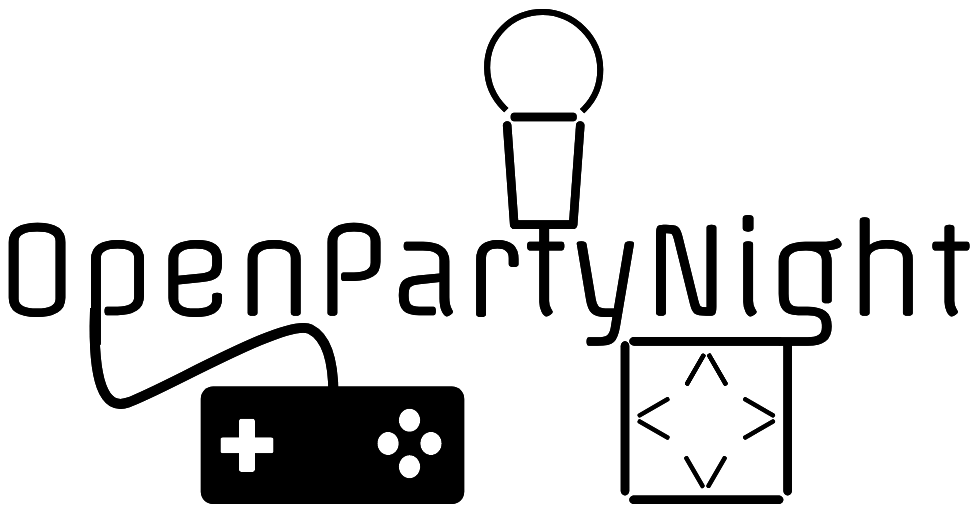

# Overview

This repo contains the various configuration notes and installation guides for the OpenPartyNight project. All the content here will eventually become a well-structured knowledgebase with pretty screenshots.

## Document Structure

The documentation currently is broken up as follows:

- Base: Guides for setting up the OS and system services
- Applications: Guides for compiling & configuring the games & additional applications
- Usage: User guides for the games and applications included in the system

